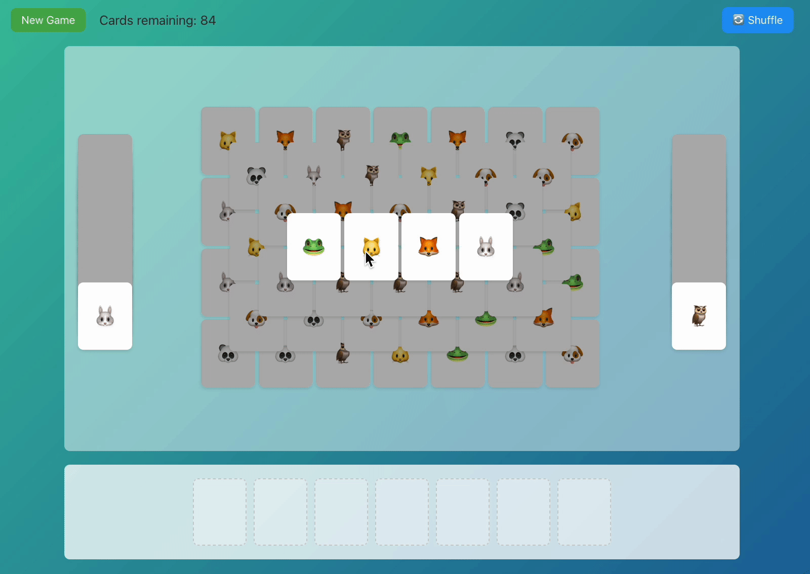

# Match3 Game

A fun and interactive card matching game built with Vue 3 and Vite. Match pairs of cards from the main board while managing two side decks in this engaging memory challenge!



## Game Rules

1. Cards are randomly distributed on the main board and in two side decks
2. Click cards to reveal their emoji symbols
3. Match pairs of identical cards to clear them
4. Use the side decks strategically to complete matches
5. Clear all cards to win the game!

## Project Setup

### Prerequisites

- Node.js (v14 or higher recommended)
- npm (Node Package Manager)

### Installation

```sh
# Clone the repository
git clone https://github.com/ivenpoon/match3.git

# Navigate to project directory
cd match3

# Install dependencies
npm install
```

### Development

```sh
# Start development server
npm run dev
```

### Production

```sh
# Build for production
npm run build
```

## Technical Stack

- Vue 3
- Vite
- TypeScript
- CSS3 for animations and layout

## Contributing

Feel free to submit issues and enhancement requests!

## License

This project is licensed under the MIT License - see the [LICENSE](LICENSE) file for details. 